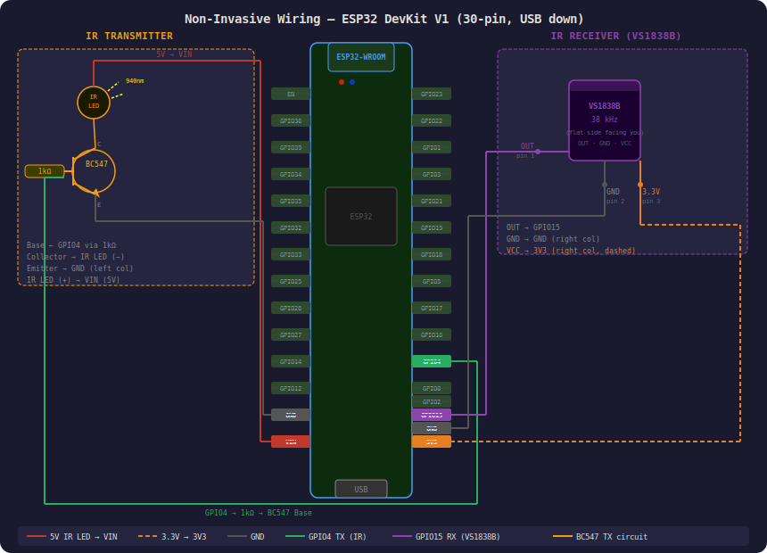
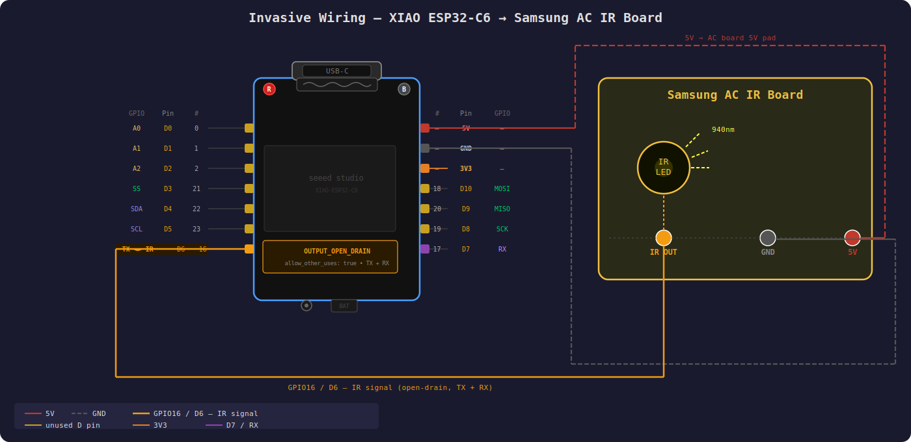

# ESPHome Samsung AC IR Component

An ESPHome external component for Samsung split-type air conditioners using infrared control.

Tested on **Samsung AR12MCFHDWKYFE** and similar Samsung Wind-Free series units.

---

## Installation

### Option A — GitHub external component (recommended)

```yaml
external_components:
  - source: github://farhadbinfarooq/samsung-ac-wifi@main
    components: [samsung]
```

### Option B — Local component

Copy the `components/samsung/` folder into your ESPHome config directory under `custom_components/samsung/`, then:

```yaml
external_components:
  - source:
      type: local
      path: custom_components
    components: [samsung]
```

---

## Hardware Installation

You have two options for connecting the XIAO ESP32-C6 to your Samsung AC.

---

### Method 1 — Non-Invasive (Recommended for beginners)

Build a separate IR transmitter circuit and connect a VS1838B IR receiver module to the XIAO ESP32-C6 GPIOs. Place the board near the AC indoor unit so it can both receive signals from the physical remote and send commands to the AC IR sensor.



**Components needed:**

- IR LED (940nm, e.g. TSAL6400)
- BC547 NPN transistor
- 1kΩ resistor
- VS1838B IR receiver module

**Connections:**

| XIAO ESP32-C6 Pin | Connects to | Notes |
| --- | --- | --- |
| GPIO16 (TX / D6) | 1kΩ → Base of BC547 | IR transmit — left column, bottom pad |
| 5V | IR LED Anode (+) via Collector | IR LED power |
| GND | BC547 Emitter, VS1838B GND (pin 2) | Common ground |
| GPIO17 (RX / D7) | VS1838B OUT (pin 1) | IR receive — right column, bottom pad |
| 3.3V | VS1838B VCC (pin 3) | Receiver power — **must be 3.3V, not 5V** |

---

### Method 2 — Invasive (Advanced, more stable)

Connect the XIAO ESP32-C6 directly to the Samsung AC's IR board by tapping onto the IR LED signal trace. This bypasses the need for a separate IR circuit and gives much more reliable signal detection.



> ⚠️ **Warning:** Identify the correct solder pads using a multimeter before connecting. Wrong connections may damage your AC board or XIAO.

> ✅ The IR signal line on Samsung AC boards runs at **3.3V logic** — it connects directly to GPIO16 with no voltage divider or level shifter required.

**Solder pads to identify:**

- **5V** — powers the XIAO via the 5V pad
- **GND** — common ground
- **IR signal** — the line driving the IR LED on the board (shared TX+RX)

**YAML for invasive method** — same GPIO for TX and RX using open-drain:

```yaml
remote_receiver:
  id: ir_receiver
  pin:
    number: GPIO16
    inverted: true
    mode: OUTPUT_OPEN_DRAIN
    allow_other_uses: true
  tolerance: 55%
  idle: 5ms

remote_transmitter:
  pin:
    number: GPIO16
    inverted: true
    mode: OUTPUT_OPEN_DRAIN
    allow_other_uses: true
  carrier_duty_percent: 50%

climate:
  - platform: samsung
    name: "Remote Controller"
    receiver_id: ir_receiver
```

---

## Full Example Configuration (Non-Invasive)

```yaml
esphome:
  name: samsung-ac
  friendly_name: "Samsung AC"

esp32:
  board: seeed_xiao_esp32c6
  framework:
    type: esp-idf   # required for XIAO ESP32-C6 — Arduino framework not supported

external_components:
  - source: github://farhadbinfarooq/samsung-ac-wifi@main
    components: [samsung]

wifi:
  ssid: !secret wifi_ssid
  password: !secret wifi_password
  ap:
    ssid: "Samsung-AC Fallback"

captive_portal:

api:
  encryption:
    key: !secret api_key

ota:
  - platform: esphome
    password: !secret ota_password

logger:
  level: DEBUG

remote_transmitter:
  id: ir_transmitter
  pin: GPIO16       # TX / D6 — left column, bottom pad
  carrier_duty_percent: 50%

remote_receiver:
  id: ir_receiver
  pin:
    number: GPIO17  # RX / D7 — right column, bottom pad
    inverted: true
    mode:
      input: true
      pullup: true
  tolerance: 55%

climate:
  - platform: samsung
    name: "Remote Controller"
    receiver_id: ir_receiver
    transmitter_id: ir_transmitter
```

---

## Supported Features

| Feature | Supported |
| --- | --- |
| Cool | ✅ |
| Heat | ✅ |
| Dry | ✅ |
| Fan Only | ✅ |
| Auto | ✅ |
| Fan Speed (Auto / Low / Medium / High) | ✅ |
| Swing Off | ✅ |
| Swing Vertical | ✅ |
| Swing Horizontal | ✅ |
| Swing Both | ✅ |
| IR Receive (sync state from remote) | ✅ |
| Power On / Off | ✅ |
| Temperature range | 16°C – 30°C |

---

## Tested Models

| Model | Status |
| --- | --- |
| Samsung AR12MCFHDWKYFE | ✅ Tested |

If you test this on another Samsung model, please open an issue or PR to update this list.

---
